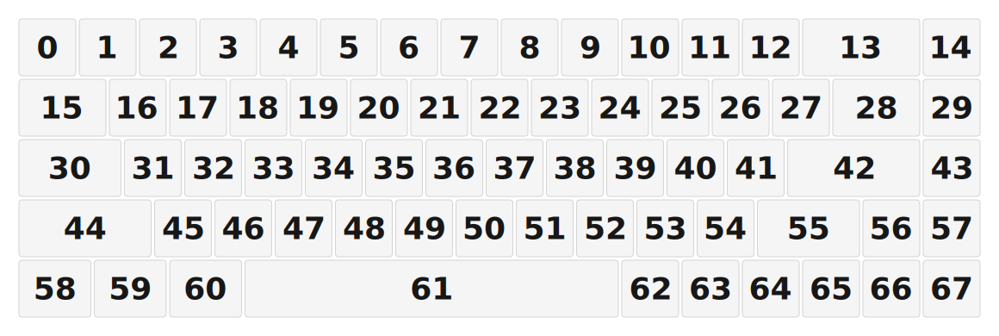

# ZMK Configuration for osprey_68

*Generated by Shield Wizard for ZMK*



Download compiled firmware from the Actions tab. <https://zmk.dev/docs/user-setup#installing-the-firmware>

Edit your keymap <https://zmk.dev/docs/keymaps>.
User keymap is located at [`config/osprey_68.keymap`](config/osprey_68.keymap).

-----

<details>
<summary>
Shield Wizard Debug Information
</summary>

In case of broken configuration, here is the Shield Wizard internal data used to generate this configuration:

Commit: 8a52249f61161469b6d90ed8c80c4aa52b9f3858

```json
{"name":"osprey_68","shield":"osprey_68","dongle":false,"modules":[],"layout":[{"id":"01KJTEEX5JVP5ZXVCGVZWP6QPT","part":0,"row":0,"col":0,"w":1,"h":1,"x":0,"y":0,"r":0,"rx":0,"ry":0},{"id":"01KJTEEX5KHM7J6Q6T5R9VHVEK","part":0,"row":0,"col":1,"w":1,"h":1,"x":1,"y":0,"r":0,"rx":0,"ry":0},{"id":"01KJTEEX5K83H5Q3TEPTFZKXNC","part":0,"row":0,"col":2,"w":1,"h":1,"x":2,"y":0,"r":0,"rx":0,"ry":0},{"id":"01KJTEEX5KGCX4T5KQKDVK3N25","part":0,"row":0,"col":3,"w":1,"h":1,"x":3,"y":0,"r":0,"rx":0,"ry":0},{"id":"01KJTEEX5K15GF6ZYT43NV0HMM","part":0,"row":0,"col":4,"w":1,"h":1,"x":4,"y":0,"r":0,"rx":0,"ry":0},{"id":"01KJTEEX5KBC8CRMS9VV9B1M8W","part":0,"row":0,"col":5,"w":1,"h":1,"x":5,"y":0,"r":0,"rx":0,"ry":0},{"id":"01KJTEEX5K33K6HHH436WH6ZPR","part":0,"row":0,"col":6,"w":1,"h":1,"x":6,"y":0,"r":0,"rx":0,"ry":0},{"id":"01KJTEEX5K2E1MXH84QJH0DBJ1","part":0,"row":0,"col":7,"w":1,"h":1,"x":7,"y":0,"r":0,"rx":0,"ry":0},{"id":"01KJTEEX5KEZF5E905KR954NPB","part":0,"row":0,"col":8,"w":1,"h":1,"x":8,"y":0,"r":0,"rx":0,"ry":0},{"id":"01KJTEEX5KVAF2GY9PDX90D3CP","part":0,"row":0,"col":9,"w":1,"h":1,"x":9,"y":0,"r":0,"rx":0,"ry":0},{"id":"01KJTEEX5KEQNBN8P7A4WMVDRM","part":0,"row":0,"col":10,"w":1,"h":1,"x":10,"y":0,"r":0,"rx":0,"ry":0},{"id":"01KJTEEX5KMH27R2FKPRZHMC1K","part":0,"row":0,"col":11,"w":1,"h":1,"x":11,"y":0,"r":0,"rx":0,"ry":0},{"id":"01KJTEEX5KAXCNMYETRWM0X6ZR","part":0,"row":0,"col":12,"w":1,"h":1,"x":12,"y":0,"r":0,"rx":0,"ry":0},{"id":"01KJTEEX5KBMQPXWJ128FSCBBN","part":0,"row":0,"col":13,"w":2,"h":1,"x":13,"y":0,"r":0,"rx":0,"ry":0},{"id":"01KJTEEX5KH0ZAQCAPQJ9DJB1K","part":0,"row":0,"col":14,"w":1,"h":1,"x":15,"y":0,"r":0,"rx":0,"ry":0},{"id":"01KJTEEX5KW6YQ65S8GJZ0EM7Z","part":0,"row":1,"col":0,"w":1.5,"h":1,"x":0,"y":1,"r":0,"rx":0,"ry":0},{"id":"01KJTEEX5K3GNH43DQMW5WRZCS","part":0,"row":1,"col":1,"w":1,"h":1,"x":1.5,"y":1,"r":0,"rx":0,"ry":0},{"id":"01KJTEEX5KW2H8SP3V6RXB9KWK","part":0,"row":1,"col":2,"w":1,"h":1,"x":2.5,"y":1,"r":0,"rx":0,"ry":0},{"id":"01KJTEEX5K5ZZK9PJ6PJB4MC05","part":0,"row":1,"col":3,"w":1,"h":1,"x":3.5,"y":1,"r":0,"rx":0,"ry":0},{"id":"01KJTEEX5KZD2AYAAXCF3XHR2G","part":0,"row":1,"col":4,"w":1,"h":1,"x":4.5,"y":1,"r":0,"rx":0,"ry":0},{"id":"01KJTEEX5KSZHSGBYEWTR6BEWM","part":0,"row":1,"col":5,"w":1,"h":1,"x":5.5,"y":1,"r":0,"rx":0,"ry":0},{"id":"01KJTEEX5KT3DWXBCV5HQV8JPZ","part":0,"row":1,"col":6,"w":1,"h":1,"x":6.5,"y":1,"r":0,"rx":0,"ry":0},{"id":"01KJTEEX5KJN2JDETB55D0111J","part":0,"row":1,"col":7,"w":1,"h":1,"x":7.5,"y":1,"r":0,"rx":0,"ry":0},{"id":"01KJTEEX5KNCWRWX53FQPNS1PY","part":0,"row":1,"col":8,"w":1,"h":1,"x":8.5,"y":1,"r":0,"rx":0,"ry":0},{"id":"01KJTEEX5KH0JBJJ2DCRWGGJ5D","part":0,"row":1,"col":9,"w":1,"h":1,"x":9.5,"y":1,"r":0,"rx":0,"ry":0},{"id":"01KJTEEX5KQSSN86QV0YBGEAPR","part":0,"row":1,"col":10,"w":1,"h":1,"x":10.5,"y":1,"r":0,"rx":0,"ry":0},{"id":"01KJTEEX5KN7T7DEGQRM0S7G3H","part":0,"row":1,"col":11,"w":1,"h":1,"x":11.5,"y":1,"r":0,"rx":0,"ry":0},{"id":"01KJTEEX5KYQAJY2AVB4G0425D","part":0,"row":1,"col":12,"w":1,"h":1,"x":12.5,"y":1,"r":0,"rx":0,"ry":0},{"id":"01KJTEEX5KPR88RZ922WB5XYAA","part":0,"row":1,"col":13,"w":1.5,"h":1,"x":13.5,"y":1,"r":0,"rx":0,"ry":0},{"id":"01KJTEEX5KFNXWV5SYK3D57EVX","part":0,"row":1,"col":14,"w":1,"h":1,"x":15,"y":1,"r":0,"rx":0,"ry":0},{"id":"01KJTEEX5K0MC34KWKA07Y6E1D","part":0,"row":2,"col":0,"w":1.75,"h":1,"x":0,"y":2,"r":0,"rx":0,"ry":0},{"id":"01KJTEEX5KTZFKYATD0K4A9NMP","part":0,"row":2,"col":1,"w":1,"h":1,"x":1.75,"y":2,"r":0,"rx":0,"ry":0},{"id":"01KJTEEX5KAB4YCMSG16GK8RPM","part":0,"row":2,"col":2,"w":1,"h":1,"x":2.75,"y":2,"r":0,"rx":0,"ry":0},{"id":"01KJTEEX5KGPS5R3TYCD9MB8SP","part":0,"row":2,"col":3,"w":1,"h":1,"x":3.75,"y":2,"r":0,"rx":0,"ry":0},{"id":"01KJTEEX5K7BD86QR4HPFSE65J","part":0,"row":2,"col":4,"w":1,"h":1,"x":4.75,"y":2,"r":0,"rx":0,"ry":0},{"id":"01KJTEEX5K8Q5143V1GS686XM1","part":0,"row":2,"col":5,"w":1,"h":1,"x":5.75,"y":2,"r":0,"rx":0,"ry":0},{"id":"01KJTEEX5KPJ6C7R71H0NAGHFH","part":0,"row":2,"col":6,"w":1,"h":1,"x":6.75,"y":2,"r":0,"rx":0,"ry":0},{"id":"01KJTEEX5KHSCH010970C91QXB","part":0,"row":2,"col":7,"w":1,"h":1,"x":7.75,"y":2,"r":0,"rx":0,"ry":0},{"id":"01KJTEEX5KQZW3VAYREPBAHSRS","part":0,"row":2,"col":8,"w":1,"h":1,"x":8.75,"y":2,"r":0,"rx":0,"ry":0},{"id":"01KJTEEX5K6H9SDFQKYSH6KNZT","part":0,"row":2,"col":9,"w":1,"h":1,"x":9.75,"y":2,"r":0,"rx":0,"ry":0},{"id":"01KJTEEX5K6Y90XFS9JDCYGG4S","part":0,"row":2,"col":10,"w":1,"h":1,"x":10.75,"y":2,"r":0,"rx":0,"ry":0},{"id":"01KJTEEX5KES45H57742A5D398","part":0,"row":2,"col":11,"w":1,"h":1,"x":11.75,"y":2,"r":0,"rx":0,"ry":0},{"id":"01KJTEEX5K2SENBH8RJ85QM1ET","part":0,"row":2,"col":13,"w":2.25,"h":1,"x":12.75,"y":2,"r":0,"rx":0,"ry":0},{"id":"01KJTEEX5KWV1C3P4A4NNZ8P60","part":0,"row":2,"col":14,"w":1,"h":1,"x":15,"y":2,"r":0,"rx":0,"ry":0},{"id":"01KJTEEX5K2MAZDB11N25EW7EJ","part":0,"row":3,"col":0,"w":2.25,"h":1,"x":0,"y":3,"r":0,"rx":0,"ry":0},{"id":"01KJTEEX5KS0Z92GWMFNY231HZ","part":0,"row":3,"col":2,"w":1,"h":1,"x":2.25,"y":3,"r":0,"rx":0,"ry":0},{"id":"01KJTEEX5KRSXEFDAZ7E5FQCRZ","part":0,"row":3,"col":3,"w":1,"h":1,"x":3.25,"y":3,"r":0,"rx":0,"ry":0},{"id":"01KJTEEX5K7TEV2G1VN60JAAQG","part":0,"row":3,"col":4,"w":1,"h":1,"x":4.25,"y":3,"r":0,"rx":0,"ry":0},{"id":"01KJTEEX5KTQDQ6SWYSPHRT7ZT","part":0,"row":3,"col":5,"w":1,"h":1,"x":5.25,"y":3,"r":0,"rx":0,"ry":0},{"id":"01KJTEEX5KY8G4PQJDCYBPMVHR","part":0,"row":3,"col":6,"w":1,"h":1,"x":6.25,"y":3,"r":0,"rx":0,"ry":0},{"id":"01KJTEEX5KXTEKDM25QE2ZX2JD","part":0,"row":3,"col":7,"w":1,"h":1,"x":7.25,"y":3,"r":0,"rx":0,"ry":0},{"id":"01KJTEEX5KYER2HSFDK54AQCPT","part":0,"row":3,"col":8,"w":1,"h":1,"x":8.25,"y":3,"r":0,"rx":0,"ry":0},{"id":"01KJTEEX5K2B2BD9JR2S6EGR2Z","part":0,"row":3,"col":9,"w":1,"h":1,"x":9.25,"y":3,"r":0,"rx":0,"ry":0},{"id":"01KJTEEX5KJ8CW9DTAJEM2MPC3","part":0,"row":3,"col":10,"w":1,"h":1,"x":10.25,"y":3,"r":0,"rx":0,"ry":0},{"id":"01KJTEEX5KPHFG500GGGDJZ4YV","part":0,"row":3,"col":11,"w":1,"h":1,"x":11.25,"y":3,"r":0,"rx":0,"ry":0},{"id":"01KJTEEX5MDVSHHJYCSVMXDRZ9","part":0,"row":3,"col":12,"w":1.75,"h":1,"x":12.25,"y":3,"r":0,"rx":0,"ry":0},{"id":"01KJTEEX5M6BZK27V14YFR309F","part":0,"row":3,"col":13,"w":1,"h":1,"x":14,"y":3,"r":0,"rx":0,"ry":0},{"id":"01KJTEEX5MCXSTE6E1TPW6X3EQ","part":0,"row":3,"col":14,"w":1,"h":1,"x":15,"y":3,"r":0,"rx":0,"ry":0},{"id":"01KJTEEX5M4X57DBZK0PKEVGBQ","part":0,"row":4,"col":0,"w":1.25,"h":1,"x":0,"y":4,"r":0,"rx":0,"ry":0},{"id":"01KJTEEX5M6W4XXGSBHJ4R8JK1","part":0,"row":4,"col":1,"w":1.25,"h":1,"x":1.25,"y":4,"r":0,"rx":0,"ry":0},{"id":"01KJTEEX5MF4FABFR88BT309VN","part":0,"row":4,"col":2,"w":1.25,"h":1,"x":2.5,"y":4,"r":0,"rx":0,"ry":0},{"id":"01KJTEEX5MP1EQASR5Y1TQV2J2","part":0,"row":4,"col":6,"w":6.25,"h":1,"x":3.75,"y":4,"r":0,"rx":0,"ry":0},{"id":"01KJTEEX5M3T3RRSB16DAGHAFJ","part":0,"row":4,"col":10,"w":1,"h":1,"x":10,"y":4,"r":0,"rx":0,"ry":0},{"id":"01KJTEEX5MB65PXQ3G4FYWAHVP","part":0,"row":4,"col":11,"w":1,"h":1,"x":11,"y":4,"r":0,"rx":0,"ry":0},{"id":"01KJTEEX5MVA28GMHRNM5PKXB3","part":0,"row":4,"col":12,"w":1,"h":1,"x":12,"y":4,"r":0,"rx":0,"ry":0},{"id":"01KJTEEX5MWJRZ8G22FCGVVJ5E","part":0,"row":4,"col":13,"w":1,"h":1,"x":13,"y":4,"r":0,"rx":0,"ry":0},{"id":"01KJTEEX5M8924MX3TE3XRBQ5W","part":0,"row":4,"col":14,"w":1,"h":1,"x":14,"y":4,"r":0,"rx":0,"ry":0},{"id":"01KJTEEX5M48RBXRFM8TP640M2","part":0,"row":4,"col":15,"w":1,"h":1,"x":15,"y":4,"r":0,"rx":0,"ry":0}],"parts":[{"name":"unibody","controller":"nice_nano_v2","wiring":"matrix_diode","keys":{"01KJTEEX5M4X57DBZK0PKEVGBQ":{"output":"shifter0","input":"d10"},"01KJTEEX5K2MAZDB11N25EW7EJ":{"output":"shifter0","input":"d9"},"01KJTEEX5K0MC34KWKA07Y6E1D":{"output":"shifter0","input":"d8"},"01KJTEEX5KW6YQ65S8GJZ0EM7Z":{"output":"shifter0","input":"d7"},"01KJTEEX5JVP5ZXVCGVZWP6QPT":{"output":"shifter0","input":"d6"},"01KJTEEX5KTZFKYATD0K4A9NMP":{"output":"shifter1","input":"d8"},"01KJTEEX5K3GNH43DQMW5WRZCS":{"output":"shifter1","input":"d7"},"01KJTEEX5KHM7J6Q6T5R9VHVEK":{"output":"shifter1","input":"d6"},"01KJTEEX5K83H5Q3TEPTFZKXNC":{"output":"shifter2","input":"d6"},"01KJTEEX5M6W4XXGSBHJ4R8JK1":{"output":"shifter1","input":"d10"},"01KJTEEX5MF4FABFR88BT309VN":{"output":"shifter2","input":"d10"},"01KJTEEX5KS0Z92GWMFNY231HZ":{"output":"shifter2","input":"d9"},"01KJTEEX5KAB4YCMSG16GK8RPM":{"output":"shifter2","input":"d8"},"01KJTEEX5KW2H8SP3V6RXB9KWK":{"output":"shifter2","input":"d7"},"01KJTEEX5KRSXEFDAZ7E5FQCRZ":{"output":"shifter3","input":"d9"},"01KJTEEX5KGPS5R3TYCD9MB8SP":{"output":"shifter3","input":"d8"},"01KJTEEX5K5ZZK9PJ6PJB4MC05":{"output":"shifter3","input":"d7"},"01KJTEEX5KGCX4T5KQKDVK3N25":{"output":"shifter3","input":"d6"},"01KJTEEX5K7BD86QR4HPFSE65J":{"output":"shifter4","input":"d8"},"01KJTEEX5KZD2AYAAXCF3XHR2G":{"output":"shifter4","input":"d7"},"01KJTEEX5K15GF6ZYT43NV0HMM":{"output":"shifter4","input":"d6"},"01KJTEEX5K7TEV2G1VN60JAAQG":{"output":"shifter4","input":"d9"},"01KJTEEX5K8Q5143V1GS686XM1":{"output":"shifter5","input":"d8"},"01KJTEEX5KSZHSGBYEWTR6BEWM":{"output":"shifter5","input":"d7"},"01KJTEEX5KBC8CRMS9VV9B1M8W":{"output":"shifter5","input":"d6"},"01KJTEEX5KTQDQ6SWYSPHRT7ZT":{"output":"shifter5","input":"d9"},"01KJTEEX5MP1EQASR5Y1TQV2J2":{"output":"shifter6","input":"d10"},"01KJTEEX5KY8G4PQJDCYBPMVHR":{"output":"shifter6","input":"d9"},"01KJTEEX5KPJ6C7R71H0NAGHFH":{"output":"shifter6","input":"d8"},"01KJTEEX5KT3DWXBCV5HQV8JPZ":{"output":"shifter6","input":"d7"},"01KJTEEX5K33K6HHH436WH6ZPR":{"output":"shifter6","input":"d6"},"01KJTEEX5KXTEKDM25QE2ZX2JD":{"output":"shifter7","input":"d9"},"01KJTEEX5KHSCH010970C91QXB":{"output":"shifter7","input":"d8"},"01KJTEEX5KJN2JDETB55D0111J":{"output":"shifter7","input":"d7"},"01KJTEEX5K2E1MXH84QJH0DBJ1":{"output":"shifter7","input":"d6"},"01KJTEEX5KYER2HSFDK54AQCPT":{"output":"shifter8","input":"d9"},"01KJTEEX5KQZW3VAYREPBAHSRS":{"output":"shifter8","input":"d8"},"01KJTEEX5KNCWRWX53FQPNS1PY":{"output":"shifter8","input":"d7"},"01KJTEEX5KEZF5E905KR954NPB":{"output":"shifter8","input":"d6"},"01KJTEEX5K6H9SDFQKYSH6KNZT":{"output":"shifter9","input":"d8"},"01KJTEEX5KH0JBJJ2DCRWGGJ5D":{"output":"shifter9","input":"d7"},"01KJTEEX5KVAF2GY9PDX90D3CP":{"output":"shifter9","input":"d6"},"01KJTEEX5K2B2BD9JR2S6EGR2Z":{"output":"shifter9","input":"d9"},"01KJTEEX5M3T3RRSB16DAGHAFJ":{"output":"shifter10","input":"d10"},"01KJTEEX5KJ8CW9DTAJEM2MPC3":{"output":"shifter10","input":"d9"},"01KJTEEX5K6Y90XFS9JDCYGG4S":{"output":"shifter10","input":"d8"},"01KJTEEX5KQSSN86QV0YBGEAPR":{"output":"shifter10","input":"d7"},"01KJTEEX5KEQNBN8P7A4WMVDRM":{"output":"shifter10","input":"d6"},"01KJTEEX5MB65PXQ3G4FYWAHVP":{"output":"shifter11","input":"d10"},"01KJTEEX5KPHFG500GGGDJZ4YV":{"output":"shifter11","input":"d9"},"01KJTEEX5KES45H57742A5D398":{"output":"shifter11","input":"d8"},"01KJTEEX5KN7T7DEGQRM0S7G3H":{"output":"shifter11","input":"d7"},"01KJTEEX5KMH27R2FKPRZHMC1K":{"output":"shifter11","input":"d6"},"01KJTEEX5MVA28GMHRNM5PKXB3":{"output":"shifter12","input":"d10"},"01KJTEEX5MDVSHHJYCSVMXDRZ9":{"output":"shifter12","input":"d9"},"01KJTEEX5KYQAJY2AVB4G0425D":{"output":"shifter12","input":"d7"},"01KJTEEX5KAXCNMYETRWM0X6ZR":{"output":"shifter12","input":"d6"},"01KJTEEX5MWJRZ8G22FCGVVJ5E":{"output":"shifter13","input":"d10"},"01KJTEEX5M6BZK27V14YFR309F":{"output":"shifter13","input":"d9"},"01KJTEEX5K2SENBH8RJ85QM1ET":{"output":"shifter13","input":"d8"},"01KJTEEX5KPR88RZ922WB5XYAA":{"output":"shifter13","input":"d7"},"01KJTEEX5KBMQPXWJ128FSCBBN":{"output":"shifter13","input":"d6"},"01KJTEEX5M8924MX3TE3XRBQ5W":{"output":"shifter14","input":"d10"},"01KJTEEX5MCXSTE6E1TPW6X3EQ":{"output":"shifter14","input":"d9"},"01KJTEEX5KWV1C3P4A4NNZ8P60":{"output":"shifter14","input":"d8"},"01KJTEEX5KFNXWV5SYK3D57EVX":{"output":"shifter14","input":"d7"},"01KJTEEX5KH0ZAQCAPQJ9DJB1K":{"output":"shifter14","input":"d6"},"01KJTEEX5M48RBXRFM8TP640M2":{"output":"shifter15","input":"d10"}},"encoders":[],"pins":{"d2":"bus","d3":"bus","d4":"bus","d5":"bus","d6":"input","d7":"input","d8":"input","d9":"input","d10":"input"},"buses":[{"type":"spi","name":"spi0","devices":[{"type":"74hc595","ngpios":16,"cs":"d2"}],"mosi":"d3","miso":"d4","sck":"d5"},{"type":"spi","name":"spi1","devices":[]},{"type":"spi","name":"spi2","devices":[]},{"type":"spi","name":"spi3","devices":[]},{"type":"i2c","name":"i2c0","devices":[]},{"type":"i2c","name":"i2c1","devices":[]}]}]}
```

</details>
